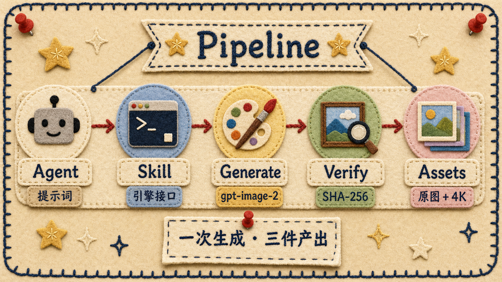
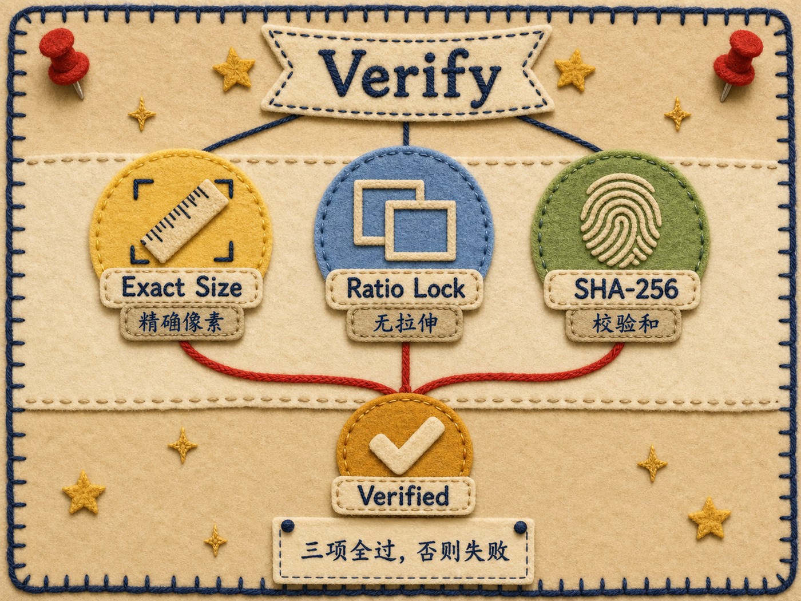

<div align="center">
  
</div>

# Image Asset Pipeline

> *「一次生成，三件产出。原图不丢，4K 精确，验证可审。」*

<div align="center">

[](LICENSE)
[](https://github.com/vercel-labs/skills)
[](https://skills.sh)
[](#-安装)
[](https://nodejs.org)
[](#-两种模型模式)

</div>

<div align="center">
<sub>自带 Provider · BYOK —— 不内置任何密钥。</sub>
</div>

---

**面向 AI Agent 的生产级图像资产流水线。** 不是又一个图片生成脚本——
它是 Agent 时代的图像导出管线：你给一句提示词，它吐回三样东西：

| 输出 | 是什么 |
|---|---|
| 🖼 **原始源图** | 规范画布，精确比例，放大前的原始资产 |
| 🖼 **精确 4K 成品** | 像素精确匹配你的目标尺寸，Lanczos3 放大 |
| 📋 **验证报告** | 尺寸、SHA-256、manifest、路由，全部可审计 |

**[看效果](#-效果演示)** · **[安装](#-安装)** · **[工作原理](#-工作原理)** · **[English](#english)**

---

## 🎯 核心价值

这个项目的核心是一个**本地图像生成引擎**（Task API）。它做三件直接调 API 做不到的事：

| 问题 | 直接调图像 API | 本流水线引擎 |
|---|---|---|
| **比例变形** | API 返回的画布比例对不上目标 → 拉伸变形 | 强制精确整数像素比匹配，**绝不拉伸** |
| **尺寸不对** | 你要 4K，API 给 1K，放大就糊 | 从比例匹配的源画布做 Lanczos3 放大 |
| **无可审计链路** | 只得到一个 blob，无出处 | 源图 + 成品 + manifest + SHA-256，**每次都有** |

**Skill 和 MCP 是引擎的接口**——它们让 Claude / Codex / Cursor 能驱动引擎。但引擎本身才是核心：没有引擎，就没有精确比例、没有双资产、没有验证。

---

## ✨ 效果演示

> **你：** *"生成一张电影感产品图。"*

**Agent（通过 Skill / MCP 驱动引擎）：**

```
→ image_job_create
    prompt: "cinematic product image"
    ratio: 3:4
    dimensions: 2160x2880
    model: gpt-image-2

✓ 源图资产生成   (asset_7ffd…, 1086×1448, 3:4)
✓ 4K 生产资产生成 (asset_6b2a…, 2160×2880, 精确)
✓ 验证完成
    · 尺寸: 2160x2880 ✓
    · 比例不变量: 1086×2880 == 2160×1448 ✓
    · SHA-256: 9f3a…e21c 匹配 manifest ✓
```

### 双资产输出

一个提示词 → 两个资产，比例互相锁定。

<table align="center">
  <tr>
    <td align="center" width="50%">
      <br>
      <sub><b>源图</b> · 1086×1448 · 3:4</sub><br>
      <sub>原始画布，放大前</sub>
    </td>
    <td align="center" width="50%">
      <br>
      <sub><b>成品</b> · 2160×2880 · 3:4</sub><br>
      <sub>精确目标像素，Lanczos3</sub>
    </td>
  </tr>
</table>

<div align="center">
<sub>同一提示词，同一比例。成品恰好是源图的 2 倍——不重新生成，比例零漂移。</sub>
</div>

---

## 🚀 安装

### 第一步：克隆并启动引擎（核心）

引擎是这个项目的核心。必须先启动它，Skill 和 MCP 才能工作。

```bash
git clone https://github.com/wanghao137/image-asset-pipeline.git
cd image-asset-pipeline/generate-image-asset
npm install
```

> **关于 `sharp`：** 引擎用 [`sharp`](https://sharp.pixelplumbing.com/) 做图像缩放——原生库，首次 `npm install` 会编译（约 30-60 秒）。需要 Node.js 22+。

配置一次——在仓库根目录创建 `.env.local`（**永不分享或提交**）：

```dotenv
IMAGE_TASK_API_TOKEN=随便填一串长随机字符串
IMAGE_TASK_API_PORT=9789
IMAGE_TASK_PROVIDER_BASE_URL=https://你的-api-endpoint/v1
IMAGE_TASK_PROVIDER_API_KEY=你的-secret-key
IMAGE_TASK_PROVIDER_MODEL=gpt-image-2
```

启动引擎：

```bash
npm run engine
# → TaoStudio Image API listening at http://127.0.0.1:9789
```

引擎起来后，你就可以用命令行出图了：

```bash
# Windows
set IMAGE_TASK_API_TOKEN=你上面填的-token
py -3 scripts\run_image_job.py --backend task-api --api-url http://127.0.0.1:9789 ^
  --prompt "一只橘猫趴在木制门廊上，午后阳光，照片级真实" ^
  --model gpt-image-2 --api-mode images --provider configured ^
  --size 2160x3840 --quality high --out my-image.png

# macOS / Linux
export IMAGE_TASK_API_TOKEN=你上面填的-token
python3 scripts/run_image_job.py --backend task-api --api-url http://127.0.0.1:9789 \
  --prompt "一只橘猫趴在木制门廊上，午后阳光，照片级真实" \
  --model gpt-image-2 --api-mode images --provider configured \
  --size 2160x3840 --quality high --out my-image.png
```

产出**三个文件**：

| 文件 | 它是什么 |
|---|---|
| `my-image-source.png` | **原始源图** —— 规范画布，精确比例，放大前 |
| `my-image.png` | **精确 4K 成品** —— 最终像素精确匹配 `--size` |
| `my-image.report.json` | **验证报告** —— 尺寸、SHA-256、manifest、路由 |

### 第二步：接入 AI Agent（二选一）

引擎跑起来后，用以下**任一方式**让 AI Agent 驱动它。两种方式平级，按你用的工具选：

<table>
  <tr>
    <th width="50%" align="center">方式 A：Skill</th>
    <th width="50%" align="center">方式 B：MCP</th>
  </tr>
  <tr>
    <td valign="top">
      适合 Claude Code / Codex / Cursor 等 Agent runtime。
      <br><br>
      <pre lang="bash">npx skills add wanghao137/image-asset-pipeline</pre>
      指定 runtime：
      <pre lang="bash">npx skills add wanghao137/image-asset-pipeline -a claude-code
npx skills add wanghao137/image-asset-pipeline -a codex
npx skills add wanghao137/image-asset-pipeline -a cursor</pre>
      支持：Claude Code · Codex · Cursor · OpenCode · Gemini CLI · OpenClaw（共 70+）
    </td>
    <td valign="top">
      适合任何 MCP 兼容客户端（Cursor / Claude Desktop / 自建 Agent）。
      <br><br>
      在 AI 工具的 MCP 配置里加：
      <pre lang="json">{
  "command": "node",
  "args": ["/你的路径/generate-image-asset/engine/mcp-server.mjs"],
  "env": {
    "IMAGE_TASK_API_URL": "http://127.0.0.1:9789",
    "IMAGE_TASK_API_TOKEN": "你-env-local-里的-token"
  }
}</pre>
      获得 6 个工具：create / get / wait / cancel / upload / download
    </td>
  </tr>
</table>

> 无论选哪种，都连到第一步启动的引擎。**引擎必须在运行**，否则出不了图。

<details>
<summary><b>MCP 六个工具详情</b></summary>

| 工具 | 用途 |
|---|---|
| `image_asset_upload(path)` | 上传本地 PNG，返回资产 ID + manifest |
| `image_job_create(...)` | 创建幂等生成任务 |
| `image_job_get(jobId)` | 读取状态 + 事件 |
| `image_job_wait(jobId, timeoutMs)` | 最多等待 30 分钟 |
| `image_job_cancel(jobId)` | 取消排队中或进行中的任务 |
| `image_asset_download(assetId, outputPath)` | 独占写入下载（绝不静默覆盖） |

</details>

---

## 🏗 工作原理



**流水线不变量：** 比例只在生成阶段选一次。源画布是唯一真相源；4K 成品永远只是源图的 Lanczos3 重缩放——不重新提示词、不拉伸、不透明补边。

### 验证流程

三个硬校验门控每个成功的任务。任一失败，任务即失败——**绝无静默损坏**。



只有当三者都成立，任务才标记 `succeeded`：

1. **尺寸精确** —— 成品像素精确匹配请求的 `--size`
2. **比例锁定** —— 源图与成品交叉乘积相等（`srcW×finalH == finalW×srcH`）
3. **SHA-256 校验** —— 下载文件哈希等于服务端 manifest

---

## ✨ 核心能力

<table>
  <tr>
    <td width="50%" align="center" valign="top">
      <h3>🎯 精确比例引擎</h3>
      <p><b>无拉伸。无变形。</b></p>
      <p>源图与成品共享严格一致的整数像素比。</p>
    </td>
    <td width="50%" align="center" valign="top">
      <h3>🖼 双资产输出</h3>
      <p><b>源图 + 4K。</b></p>
      <p>每个任务都产出原始画布<em>和</em>放大后成品。</p>
    </td>
  </tr>
  <tr>
    <td width="50%" align="center" valign="top">
      <h3>🔍 验证层</h3>
      <p><b>SHA-256 验证资产。</b></p>
      <p>下载字节校对 manifest。尺寸精确断言。</p>
    </td>
    <td width="50%" align="center" valign="top">
      <h3>🤖 Agent 原生</h3>
      <p><b>Claude · Codex · Cursor · MCP。</b></p>
      <p>Skill 规范 + MCP 服务器。6 个类型化工具。</p>
    </td>
  </tr>
</table>

---

## 🔀 两种模型模式

| 模型类型 | `--model` | `--api-mode` | 示例 |
|---|---|---|---|
| 图像模型 | `gpt-image-2` 等 | `images` | 专用图像模型（最常见） |
| 文本模型 | `gpt-5.6-sol` 等 | `responses` | 通过 Responses API 输出图像的对话模型 |

**关键：** 模型和 api-mode 必须匹配。图像模型用 `images`，文本模型用 `responses`。不匹配报错（如 *"requires an image model"*）。

---

## 📋 常用参数

| 参数 | 默认值 | 说明 |
|---|---|---|
| `--backend` | `built-in` | `task-api`（推荐，用本仓库引擎） |
| `--prompt-file` | — | 提示词文本文件路径（长提示词用） |
| `--size` | `2160x3840` | 最终尺寸，同时决定比例 |
| `--model` | `gpt-image-2` | 模型名 |
| `--api-mode` | `images` | `images` 或 `responses` |
| `--provider` | `mock` | `configured`（用 `.env.local` 真实配置） |
| `--quality` | `high` | 图像质量 |
| `--content-class` | `photo` | `photo` / `illustration` / `text` / `logo` / `ui` |
| `--enhancement` | `auto` | 放大算法，`lanczos3` 最常用 |
| `--max-attempts` | `3` | 失败重试次数（1-5） |
| `--out` | `output/.../output.png` | 输出路径 |
| `--force` | 关 | 覆盖已存在文件（不加此标记会拒绝） |

**支持比例：** `1:1` · `3:2` · `2:3` · `16:9` · `9:16` · `4:3` · `3:4` · `21:9`

---

## ✅ 验证安装

```bash
npm test
```

预期：**20 个测试通过**（用 mock provider，不需要真实 API key）。

---

## ❓ 常见问题

**`npm install` 失败 / sharp 编译不过？**
确保 Node.js 22+。Windows 装 Visual Studio Build Tools，macOS 装 Xcode Command Line Tools。详见 [sharp 安装文档](https://sharp.pixelplumbing.com/install)。

**Skill 装完了为什么出不了图？**
Skill 需要引擎在运行。先按[第一步](#第一步克隆并启动引擎核心)启动 `npm run engine`，确保 `http://127.0.0.1:9789` 可达，Skill 用 `--backend task-api` 连引擎出图。

**"generation base size conflicts with the requested composition ratio"？**
请求了不支持的比例（如 `4:5`）。用上面列出的支持比例。`--size` 宽高比必须能约分为支持的比例。

**"requires an image model" 错误？**
文本模型（如 `gpt-5.6-sol`）配了 `--api-mode images`。改成 `--api-mode responses`。

**"connection refused"？**
引擎没在跑。确认 `npm run engine` 在运行，且 `--api-url` 与 `.env.local` 里的端口一致。

---

## 📁 项目结构

```
generate-image-asset/
├── engine/                          # 生成引擎（核心）
│   ├── service.mjs                  # 任务调度、比例校验、缩放
│   ├── cli.mjs                      # 入口（npm run engine）
│   ├── mcp-server.mjs               # MCP 服务器（npm run mcp）
│   └── service.test.mjs             # 引擎测试（npm test）
├── scripts/
│   ├── run_image_job.py             # Skill CLI 入口
│   └── image_core_cli.mjs           # 几何计算 CLI
├── vendor/image-job-core/           # 共享契约（比例、尺寸、验证）
├── SKILL.md                         # Agent Skill 规范
├── package.json
└── .env.local                       # 你的密钥（gitignored）
```

---

## 🔗 相关

引擎是 [TaoStudio Image Lab](https://github.com/wanghao137/taostudio-image-lab) Task API 的可发布镜像，共享同一份 Image Job Contract v1。通过同步脚本保持一致。

---

## English

**Production-grade AI image asset pipeline for Agents.** The core is a local generation engine (Task API) that turns one prompt into three verified outputs: original source image, exact 4K production asset, and a verification report (dimensions + ratio invariant + SHA-256).

**Setup:** `git clone` → `npm install` → configure `.env.local` → `npm run engine` → use the CLI, or install the Skill / MCP to let Claude / Codex / Cursor drive it.

**Why an engine?** Direct API calls stretch ratios, return wrong sizes, and leave no audit trail. The engine forces exact integer-pixel ratio matching, Lanczos3 upscaling from a ratio-locked source canvas, and SHA-256 verification against a server manifest. Skill and MCP are interfaces to the engine — without it running, there's no precise ratio, no dual asset, no verification.

See the Chinese sections above for full parameter reference, MCP config, and FAQ.

---

<div align="center">

一次生成，三件产出。
原图不丢，4K 精确，验证可审。

</div>

---

## 📜 许可证

[MIT](./LICENSE) —— 可商用，保留版权声明即可。
