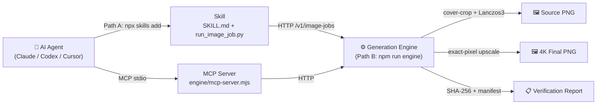
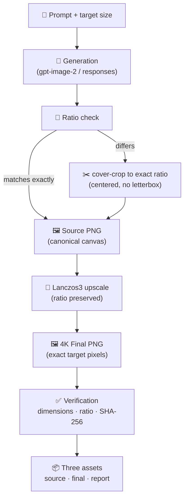
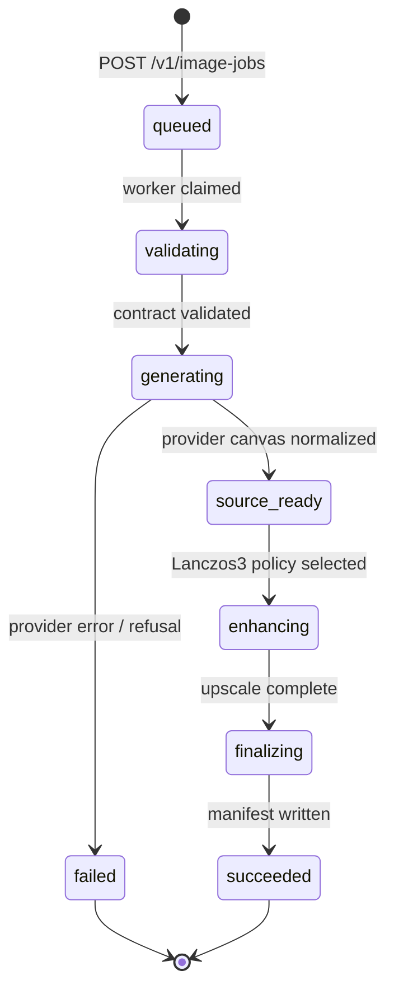
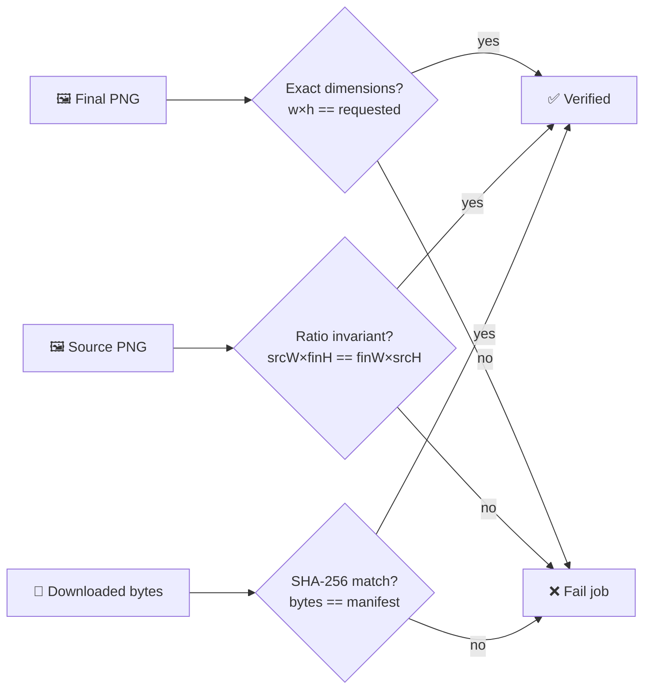

**[English](./README.md)** | [简体中文](./README.zh-CN.md)

<p align="center">
  
</p>

<h1 align="center">Image Asset Pipeline</h1>

<p align="center">
  <em>Production-grade AI image asset pipeline for Agents.</em><br>
  <strong>Generate once. Receive:</strong> Original Source Image · Exact 4K Production Asset · Verification Report
</p>

<p align="center">
  <em>The export pipeline for the AI Agent era.</em>
</p>

<p align="center">
  <a href="LICENSE"></a>
  
  
  
  
  
  
</p>

<p align="center"><sub>Bring your own provider · BYOK — no keys bundled.</sub></p>

---

> Local-first HTTP engine · Idempotent jobs (SHA-keyed) · Cross-process SQLite lock · 20 unit tests · Cover-crop + Lanczos3 pipeline · MCP stdio server

---

## 🚀 Install

Two ways to use it. Pick the one that matches your goal.

### Path A — Skill only (let your AI assistant generate images)

Best for: you use Claude Code, Codex, Cursor, or any MCP-compatible agent and just want it to produce images for you.

```bash
npx skills add wanghao137/generate-image-asset-skill
```

This installs the Skill (`SKILL.md` + `scripts/run_image_job.py`) into your agent's skills directory. The CLI auto-detects the installed agent runtime.

Want to target a specific runtime?

```bash
# Claude Code
npx skills add wanghao137/generate-image-asset-skill -a claude-code

# Codex
npx skills add wanghao137/generate-image-asset-skill -a codex

# Cursor
npx skills add wanghao137/generate-image-asset-skill -a cursor
```

Supported runtimes: **Claude Code · Codex · Cursor · OpenCode · Gemini CLI · OpenClaw** and 70+ more via [`npx skills`](https://github.com/vercel-labs/skills).

> ⚠️ **What Path A does NOT do:** it installs the Skill, but image generation itself needs the engine running (Path B) or your agent's built-in image tool. See [How they fit together](#-how-the-paths-fit-together).

### Path B — Local engine (batch 4K production assets)

Best for: you want a self-contained generation engine on your machine for scripts, automation, or MCP.

```bash
git clone https://github.com/wanghao137/generate-image-asset-skill.git
cd generate-image-asset-skill/generate-image-asset
npm install
```

> **Note on `sharp`:** the engine uses [`sharp`](https://sharp.pixelplumbing.com/) for image scaling — it's a native library, so the first `npm install` compiles it (~30-60s). This is the only "heavy" dependency. Requires Node.js 22+.

Configure once — create `.env.local` in the repo root (**never share or commit this file**):

```dotenv
IMAGE_TASK_API_TOKEN=make-up-a-long-random-string-here
IMAGE_TASK_API_PORT=9789
IMAGE_TASK_PROVIDER_BASE_URL=https://your-api-endpoint/v1
IMAGE_TASK_PROVIDER_API_KEY=your-secret-key
IMAGE_TASK_PROVIDER_MODEL=gpt-image-2
```

Start the engine:

```bash
npm run engine
# → TaoStudio Image Task API listening at http://127.0.0.1:9789
```

Generate your first verified asset:

```bash
# Windows
set IMAGE_TASK_API_TOKEN=your-token-from-above
py -3 scripts\run_image_job.py --backend task-api --api-url http://127.0.0.1:9789 \
  --prompt "a ginger cat on a wooden porch, afternoon light, photoreal" \
  --model gpt-image-2 --api-mode images --provider configured \
  --size 2160x3840 --quality high --out my-image.png

# macOS / Linux
export IMAGE_TASK_API_TOKEN=your-token-from-above
python3 scripts/run_image_job.py --backend task-api --api-url http://127.0.0.1:9789 \
  --prompt "a ginger cat on a wooden porch, afternoon light, photoreal" \
  --model gpt-image-2 --api-mode images --provider configured \
  --size 2160x3840 --quality high --out my-image.png
```

This produces **three files** — the dual-asset output the pipeline is built around:

| File | What it is |
|---|---|
| `my-image-source.png` | **Original Source Image** — canonical canvas, exact ratio, pre-upscale |
| `my-image.png` | **Exact 4K Production Asset** — final pixels match your `--size` exactly |
| `my-image.report.json` | **Verification Report** — dimensions, SHA-256, manifest, route |

### How the paths fit together



---

## ✨ Core Capabilities

<table>
  <tr>
    <td width="50%" align="center" valign="top">
      <h3>🎯 Exact Ratio Engine</h3>
      <p><strong>No stretching. No distortion.</strong></p>
      <p>Source and final share an identical integer-pixel ratio<br>(<code>sourceW × finalH == finalW × sourceH</code>).</p>
    </td>
    <td width="50%" align="center" valign="top">
      <h3>🖼 Dual Asset Output</h3>
      <p><strong>Source + 4K.</strong></p>
      <p>Every job emits the original canvas <em>and</em> the upscaled production asset — nothing is lost.</p>
    </td>
  </tr>
  <tr>
    <td width="50%" align="center" valign="top">
      <h3>🔍 Verification Layer</h3>
      <p><strong>SHA-256 verified assets.</strong></p>
      <p>Downloaded bytes are checksummed against the server manifest. Dimensions are asserted exactly.</p>
    </td>
    <td width="50%" align="center" valign="top">
      <h3>🤖 Agent Native</h3>
      <p><strong>Claude · Codex · Cursor · MCP.</strong></p>
      <p>Skill spec + MCP stdio server. Six typed tools for create / poll / wait / cancel / upload / download.</p>
    </td>
  </tr>
</table>

### Why not call the image API directly?

| Problem | Direct API call | This pipeline |
|---|---|---|
| **Distorted ratio** | API returns a canvas that doesn't match your target → stretching distorts it | Forces exact integer-pixel ratio match, never stretches |
| **Wrong size** | You want 4K, API gives 1K, upscaling is blurry | Lanczos3 upscale from a ratio-matched source canvas |
| **Transparent edges** | `contain` mode adds empty borders | Uses `cover` geometry — no letterboxing, full bleed |
| **No audit trail** | You get one blob, no provenance | Source + final + manifest + SHA-256, every time |

---

## 🏗 Architecture Pipeline



**The pipeline invariant:** ratio is selected exactly once (at generation). The source canvas is the single source of truth; the 4K final is only ever a Lanczos3 rescale of that source — never a re-prompt, never a stretch, never a transparent pad.

---

## 🖼 Dual Output Showcase

One prompt → two assets, ratio-locked to each other.

<p align="center">
  <table>
    <tr>
      <td align="center" width="50%">
        <br>
        <sub><strong>Source</strong> · 1086×1448 · 3:4</sub><br>
        <sub>original canvas, pre-upscale</sub>
      </td>
      <td align="center" width="50%">
        <br>
        <sub><strong>Final</strong> · 2160×2880 · 3:4</sub><br>
        <sub>exact target pixels, Lanczos3</sub>
      </td>
    </tr>
  </table>
</p>

<p align="center"><sub>Same prompt, same ratio. Final is exactly 2× source — no re-generation, no ratio drift.</sub></p>

<details>
<summary><strong>🎬 See the full event lifecycle</strong></summary>

Every job flows through these states, each recorded as an immutable event:



</details>

---

## 🔍 Verification Diagram

Three hard checks gate every successful job. If any fails, the job fails — no silent corruption.



**A job is `succeeded` only when all three hold:**
1. Final pixels exactly match the requested `--size`.
2. Source and final cross-products are equal at integer precision.
3. Downloaded file SHA-256 equals the server manifest.

---

## 🤖 Use via AI assistant (MCP)

If you use Cursor, Claude Desktop, or any MCP-compatible AI tool, it can drive the engine for you. After [Path B setup](#path-b--local-engine-batch-4k-production-assets), add this to your AI tool's MCP config:

```json
{
  "command": "node",
  "args": ["/your/path/generate-image-asset/engine/mcp-server.mjs"],
  "env": {
    "IMAGE_TASK_API_URL": "http://127.0.0.1:9789",
    "IMAGE_TASK_API_TOKEN": "your-token-from-env-local"
  }
}
```

The assistant gains **six typed tools**:

| Tool | Purpose |
|---|---|
| `image_asset_upload(path)` | Upload a local PNG, returns asset ID + manifest |
| `image_job_create(...)` | Create an idempotent generation job |
| `image_job_get(jobId)` | Read state + events |
| `image_job_wait(jobId, timeoutMs)` | Wait up to 30 min for completion |
| `image_job_cancel(jobId)` | Cancel a queued/active job |
| `image_asset_download(assetId, outputPath)` | Download PNG with exclusive-write (never silent overwrite) |

---

## 💬 Demo Workflow

> **You:** *"Create a cinematic product image."*

**Agent (running this pipeline):**

```
→ image_job_create
    prompt: "cinematic product image"
    ratio: 3:4
    dimensions: 2160x2880
    model: gpt-image-2

✓ Source asset generated   (asset_7ffd…, 1086×1448, 3:4)
✓ 4K production asset generated (asset_6b2a…, 2160×2880, exact)
✓ Verification completed
    · dimensions: 2160x2880 ✓
    · ratio invariant: 1086×2880 == 2160×1448 ✓
    · SHA-256: 9f3a…e21c matches manifest ✓
```

---

## 🔀 Two model modes

| Model type | `--model` | `--api-mode` | Example |
|---|---|---|---|
| Image model | `gpt-image-2` etc. | `images` | Dedicated image models (most common) |
| Text model | `gpt-5.6-sol` etc. | `responses` | Chat models that emit images via Responses API |

**Key:** model and api-mode must match. Image models use `images`; text models use `responses`. Mismatching returns an error (e.g. *"requires an image model"*).

Text-model example:

```bash
python3 scripts/run_image_job.py --backend task-api --api-url http://127.0.0.1:9789 \
  --prompt "minimalist tech brand banner illustration" \
  --model gpt-5.6-sol --api-mode responses --provider configured \
  --size 2880x2880 --quality high --out my-image.png
```

---

## 📋 Common parameters

| Parameter | Default | Description |
|---|---|---|
| `--backend` | `built-in` | `task-api` (recommended, uses this repo's engine) |
| `--prompt-file` | — | Path to a prompt text file (use for long prompts) |
| `--prompt` | — | Pass prompt inline |
| `--size` | `2160x3840` | Final dimensions, also determines the ratio |
| `--ratio` | — | Explicit ratio; must be supported (see below) |
| `--model` | `gpt-image-2` | Model name |
| `--api-mode` | `images` | `images` or `responses` |
| `--provider` | `mock` | `configured` (uses `.env.local` real config) |
| `--quality` | `high` | Image quality |
| `--content-class` | `photo` | `photo` / `illustration` / `text` / `logo` / `ui` |
| `--enhancement` | `auto` | Upscale algorithm, `lanczos3` most common |
| `--max-attempts` | `3` | Retry count on failure (1-5) |
| `--out` | `output/.../output.png` | Output path |
| `--force` | off | Overwrite existing file (refuses without this flag) |

**Supported ratios:** `1:1` · `3:2` · `2:3` · `16:9` · `9:16` · `4:3` · `3:4` · `21:9`

---

## ✅ Verify your install

Run the test suite (uses a mock provider — no real API key needed):

```bash
npm test
```

Expected: **20 tests passing.** This is the fastest way to confirm the engine, contract, and verification logic all work on your machine.

---

## ❓ FAQ

**`npm install` fails / sharp won't compile?**
sharp is native. Ensure Node.js 22+. On Windows install Visual Studio Build Tools; on macOS install Xcode Command Line Tools. See [sharp install docs](https://sharp.pixelplumbing.com/install).

**"generation base size conflicts with the requested composition ratio"?**
You requested an unsupported ratio (e.g. `4:5`). Use one of the supported ratios above. The `--size` width:height must reduce to a supported ratio.

**"requires an image model" error?**
You used a text model (e.g. `gpt-5.6-sol`) with `--api-mode images`. Change to `--api-mode responses`.

**"connection refused"?**
The engine isn't running, or the address/port is wrong. Confirm `npm run engine` is running and `--api-url` matches the port in `.env.local`.

**"output exists; pass --force"?**
The output file already exists and the tool refuses to overwrite it. Use a different name, or add `--force`.

**How to pass the token?**
Use the `IMAGE_TASK_API_TOKEN` environment variable — never as a command-line argument (it would stay in shell history). `.env.local` is gitignored.

---

## 📁 Project structure

```
generate-image-asset/
├── engine/                          # Generation engine (Task API)
│   ├── service.mjs                  # Core: job scheduling, ratio verification, scaling
│   ├── cli.mjs                      # Entry point (npm run engine)
│   ├── mcp-server.mjs               # MCP server (npm run mcp)
│   └── service.test.mjs             # Engine tests (npm test)
├── scripts/
│   ├── run_image_job.py             # Skill CLI entry
│   └── image_core_cli.mjs           # Geometry calculation CLI
├── vendor/image-job-core/           # Shared contract impl (ratio, sizing, verification)
├── SKILL.md                         # Agent Skill spec (for npx skills add)
├── references/adversarial-review.md
├── agents/openai.yaml
├── package.json
└── .env.local                       # Your keys (gitignored)
```

---

## 🔗 Related

The engine in this repo is a publishable mirror of the [TaoStudio Image Lab](https://github.com/wanghao137/taostudio-image-lab) Task API, sharing the same Image Job Contract v1. TaoStudio Image Lab is the full web app; this repo extracts just the generation engine and tools so external users needn't clone the entire web project.

Engine code stays in sync with the main repo via a sync script.

---

## 📜 License

[MIT](./LICENSE) — free for commercial use, just keep the copyright notice.
