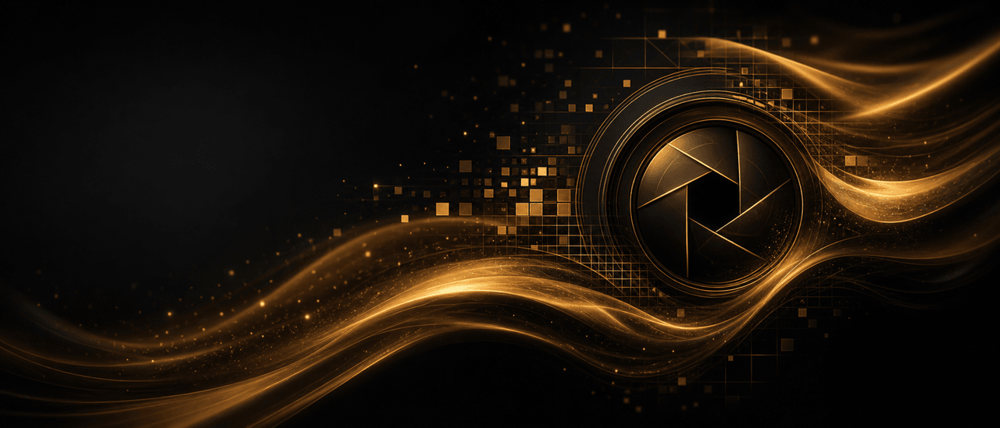
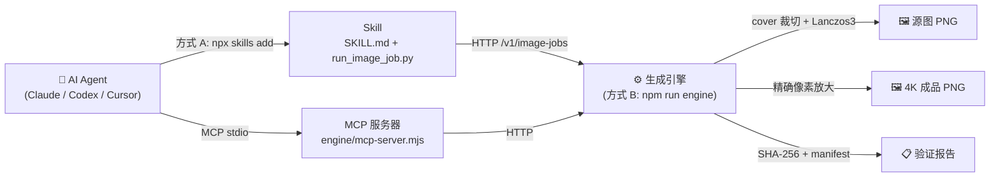
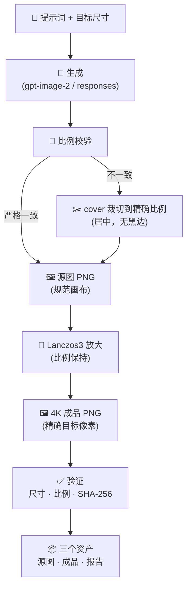
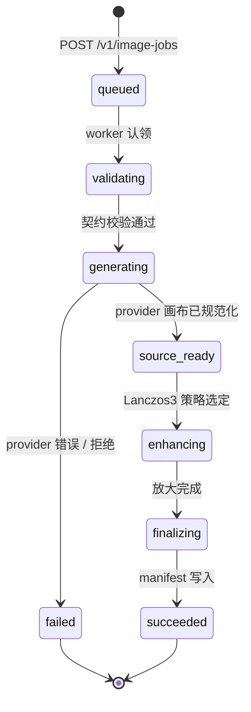
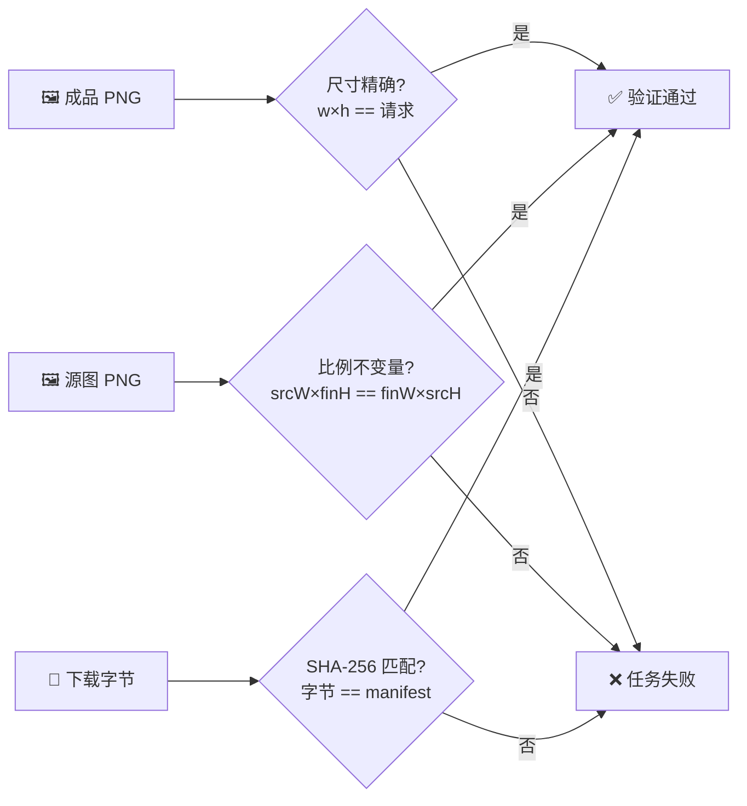

[English](./README.md) | **[简体中文](./README.zh-CN.md)**

<p align="center">
  
</p>

<h1 align="center">Image Asset Pipeline</h1>

<p align="center">
  <em>面向 AI Agent 的生产级图像资产流水线。</em><br>
  <strong>一次生成，输出：</strong>原始源图 · 精确 4K 生产资产 · 验证报告
</p>

<p align="center">
  <em>AI Agent 时代的 Photoshop 导出流水线。</em>
</p>

<p align="center">
  <a href="LICENSE"></a>
  
  
  
  
  
  
</p>

<p align="center"><sub>自带 Provider · BYOK —— 不内置任何密钥。</sub></p>

---

> 本地优先 HTTP 引擎 · 幂等任务（SHA 签名）· 跨进程 SQLite 锁 · 20 个单元测试 · cover 裁切 + Lanczos3 流水线 · MCP stdio 服务器

---

## 🚀 安装

两种用法，按你的目标选择。

### 方式 A —— 仅安装 Skill（让 AI 助手帮你出图）

适合：你在用 Claude Code、Codex、Cursor 或任何 MCP 兼容 Agent，只想让它替你产图。

```bash
npx skills add wanghao137/generate-image-asset-skill
```

这会把 Skill（`SKILL.md` + `scripts/run_image_job.py`）装进你 Agent 的 skills 目录，CLI 会自动检测已安装的 Agent runtime。

想指定 runtime？

```bash
# Claude Code
npx skills add wanghao137/generate-image-asset-skill -a claude-code

# Codex
npx skills add wanghao137/generate-image-asset-skill -a codex

# Cursor
npx skills add wanghao137/generate-image-asset-skill -a cursor
```

支持的 runtime：**Claude Code · Codex · Cursor · OpenCode · Gemini CLI · OpenClaw**，通过 [`npx skills`](https://github.com/vercel-labs/skills) 共支持 70+。

> ⚠️ **方式 A 不做的事：** 它只装 Skill。真正出图还需要引擎在运行（方式 B），或你的 Agent 自带的图像工具。详见 [两种方式如何配合](#两种方式如何配合)。

### 方式 B —— 本地引擎（批量出 4K 生产资产）

适合：你想在本机跑一个自包含的生成引擎，用于脚本、自动化或 MCP。

```bash
git clone https://github.com/wanghao137/generate-image-asset-skill.git
cd generate-image-asset-skill/generate-image-asset
npm install
```

> **关于 `sharp`：** 引擎用 [`sharp`](https://sharp.pixelplumbing.com/) 做图像缩放——它是原生库，首次 `npm install` 会编译（约 30-60 秒）。这是唯一的"重型"依赖。需要 Node.js 22+。

配置一次——在仓库根目录创建 `.env.local`（**永远不要分享或提交此文件**）：

```dotenv
IMAGE_TASK_API_TOKEN=随便填一串长随机字符串
IMAGE_TASK_API_PORT=9789
IMAGE_TASK_PROVIDER_BASE_URL=https://你的-api-endpoint/v1
IMAGE_TASK_PROVIDER_API_KEY=你的-secret-key
IMAGE_TASK_PROVIDER_MODEL=gpt-image-2
```

启动引擎：

```bash
npm run engine
# → TaoStudio Image Task API listening at http://127.0.0.1:9789
```

生成你的第一个验证资产：

```bash
# Windows
set IMAGE_TASK_API_TOKEN=你上面填的-token
py -3 scripts\run_image_job.py --backend task-api --api-url http://127.0.0.1:9789 ^
  --prompt "一只橘猫趴在木制门廊上，午后阳光，照片级真实" ^
  --model gpt-image-2 --api-mode images --provider configured ^
  --size 2160x3840 --quality high --out my-image.png

# macOS / Linux
export IMAGE_TASK_API_TOKEN=你上面填的-token
python3 scripts/run_image_job.py --backend task-api --api-url http://127.0.0.1:9789 \
  --prompt "一只橘猫趴在木制门廊上，午后阳光，照片级真实" \
  --model gpt-image-2 --api-mode images --provider configured \
  --size 2160x3840 --quality high --out my-image.png
```

这会产生**三个文件**——流水线核心的双资产输出：

| 文件 | 它是什么 |
|---|---|
| `my-image-source.png` | **原始源图** —— 规范画布，精确比例，放大前 |
| `my-image.png` | **精确 4K 生产资产** —— 最终像素精确匹配你的 `--size` |
| `my-image.report.json` | **验证报告** —— 尺寸、SHA-256、manifest、路由 |

### 两种方式如何配合



---

## ✨ 核心能力

<table>
  <tr>
    <td width="50%" align="center" valign="top">
      <h3>🎯 精确比例引擎</h3>
      <p><strong>无拉伸。无变形。</strong></p>
      <p>源图与成品共享严格一致的整数像素比<br>(<code>srcW × finalH == finalW × srcH</code>)。</p>
    </td>
    <td width="50%" align="center" valign="top">
      <h3>🖼 双资产输出</h3>
      <p><strong>源图 + 4K。</strong></p>
      <p>每个任务都产出原始画布<em>和</em>放大后的生产资产——什么都不会丢。</p>
    </td>
  </tr>
  <tr>
    <td width="50%" align="center" valign="top">
      <h3>🔍 验证层</h3>
      <p><strong>SHA-256 验证资产。</strong></p>
      <p>下载字节与服务端 manifest 校对。尺寸精确断言。</p>
    </td>
    <td width="50%" align="center" valign="top">
      <h3>🤖 Agent 原生</h3>
      <p><strong>Claude · Codex · Cursor · MCP。</strong></p>
      <p>Skill 规范 + MCP stdio 服务器。6 个类型化工具：创建 / 轮询 / 等待 / 取消 / 上传 / 下载。</p>
    </td>
  </tr>
</table>

### 为什么不直接调图像 API？

| 问题 | 直接调 API | 本流水线 |
|---|---|---|
| **比例变形** | API 返回的画布比例对不上你的目标 → 拉伸变形 | 强制精确整数像素比匹配，绝不拉伸 |
| **尺寸不对** | 你要 4K，API 给 1K，放大就糊 | 从比例匹配的源画布做 Lanczos3 放大 |
| **透明黑边** | `contain` 模式留空边 | 用 `cover` 几何裁切——无黑边，满版 |
| **无可审计链路** | 只得到一个 blob，无出处 | 源图 + 成品 + manifest + SHA-256，每次都有 |

---

## 🏗 架构流水线



**流水线不变量：** 比例只在生成阶段选择一次。源画布是唯一真相源；4K 成品永远只是源图的 Lanczos3 重缩放——不重新提示词、不拉伸、不透明补边。

---

## 🖼 双资产展示

一个提示词 → 两个资产，比例互相锁定。

<p align="center">
  <table>
    <tr>
      <td align="center" width="50%">
        <br>
        <sub><strong>源图</strong> · 1086×1448 · 3:4</sub><br>
        <sub>原始画布，放大前</sub>
      </td>
      <td align="center" width="50%">
        <br>
        <sub><strong>成品</strong> · 2160×2880 · 3:4</sub><br>
        <sub>精确目标像素，Lanczos3</sub>
      </td>
    </tr>
  </table>
</p>

<p align="center"><sub>同一提示词，同一比例。成品恰好是源图的 2 倍——不重新生成，比例零漂移。</sub></p>

<details>
<summary><strong>🎬 查看完整事件生命周期</strong></summary>

每个任务都流经以下状态，每个状态记录为不可变事件：



</details>

---

## 🔍 验证流程图

三个硬性校验门控每个成功的任务。任一失败，任务即失败——绝无静默损坏。



**只有当三者都成立，任务才标记为 `succeeded`：**
1. 成品像素精确匹配请求的 `--size`。
2. 源图与成品交叉乘积在整数精度下相等。
3. 下载文件的 SHA-256 等于服务端 manifest。

---

## 🤖 通过 AI 助手使用（MCP）

如果你用 Cursor、Claude Desktop 或任何 MCP 兼容的 AI 工具，它可以替你驱动引擎。完成[方式 B 的安装](#方式-b--本地引擎批量出-4k-生产资产)后，把这段加进你 AI 工具的 MCP 配置：

```json
{
  "command": "node",
  "args": ["/你的路径/generate-image-asset/engine/mcp-server.mjs"],
  "env": {
    "IMAGE_TASK_API_URL": "http://127.0.0.1:9789",
    "IMAGE_TASK_API_TOKEN": "你-env-local-里的-token"
  }
}
```

助手会获得**六个类型化工具**：

| 工具 | 用途 |
|---|---|
| `image_asset_upload(path)` | 上传本地 PNG，返回资产 ID + manifest |
| `image_job_create(...)` | 创建幂等生成任务 |
| `image_job_get(jobId)` | 读取状态 + 事件 |
| `image_job_wait(jobId, timeoutMs)` | 最多等待 30 分钟 |
| `image_job_cancel(jobId)` | 取消排队中或进行中的任务 |
| `image_asset_download(assetId, outputPath)` | 独占写入方式下载 PNG（绝不静默覆盖） |

---

## 💬 演示工作流

> **你：** *"生成一张电影感产品图。"*

**Agent（运行此流水线）：**

```
→ image_job_create
    prompt: "cinematic product image"
    ratio: 3:4
    dimensions: 2160x2880
    model: gpt-image-2

✓ 源图资产生成   (asset_7ffd…, 1086×1448, 3:4)
✓ 4K 生产资产生成 (asset_6b2a…, 2160×2880, 精确)
✓ 验证完成
    · 尺寸: 2160x2880 ✓
    · 比例不变量: 1086×2880 == 2160×1448 ✓
    · SHA-256: 9f3a…e21c 匹配 manifest ✓
```

---

## 🔀 两种模型模式

| 模型类型 | `--model` | `--api-mode` | 示例 |
|---|---|---|---|
| 图像模型 | `gpt-image-2` 等 | `images` | 专用图像模型（最常见） |
| 文本模型 | `gpt-5.6-sol` 等 | `responses` | 通过 Responses API 输出图像的对话模型 |

**关键：** 模型和 api-mode 必须匹配。图像模型用 `images`，文本模型用 `responses`。不匹配会报错（如 *"requires an image model"*）。

文本模型示例：

```bash
python3 scripts/run_image_job.py --backend task-api --api-url http://127.0.0.1:9789 \
  --prompt "极简科技品牌横幅插画" \
  --model gpt-5.6-sol --api-mode responses --provider configured \
  --size 2880x2880 --quality high --out my-image.png
```

---

## 📋 常用参数

| 参数 | 默认值 | 说明 |
|---|---|---|
| `--backend` | `built-in` | `task-api`（推荐，用本仓库引擎） |
| `--prompt-file` | — | 提示词文本文件路径（长提示词用） |
| `--prompt` | — | 内联传提示词 |
| `--size` | `2160x3840` | 最终尺寸，同时决定比例 |
| `--ratio` | — | 显式比例；必须是支持的（见下） |
| `--model` | `gpt-image-2` | 模型名 |
| `--api-mode` | `images` | `images` 或 `responses` |
| `--provider` | `mock` | `configured`（用 `.env.local` 真实配置） |
| `--quality` | `high` | 图像质量 |
| `--content-class` | `photo` | `photo` / `illustration` / `text` / `logo` / `ui` |
| `--enhancement` | `auto` | 放大算法，`lanczos3` 最常用 |
| `--max-attempts` | `3` | 失败重试次数（1-5） |
| `--out` | `output/.../output.png` | 输出路径 |
| `--force` | 关 | 覆盖已存在文件（不加此标记会拒绝） |

**支持的比例：** `1:1` · `3:2` · `2:3` · `16:9` · `9:16` · `4:3` · `3:4` · `21:9`

---

## ✅ 验证你的安装

运行测试套件（用 mock provider——不需要真实 API key）：

```bash
npm test
```

预期：**20 个测试通过。** 这是在你本机确认引擎、契约、验证逻辑全部正常的最快方式。

---

## ❓ 常见问题

**`npm install` 失败 / sharp 编译不过？**
sharp 是原生库。确保 Node.js 22+。Windows 装 Visual Studio Build Tools，macOS 装 Xcode Command Line Tools。详见 [sharp 安装文档](https://sharp.pixelplumbing.com/install)。

**"generation base size conflicts with the requested composition ratio"？**
你请求了不支持的比例（如 `4:5`）。用上面列出的支持比例之一。`--size` 的宽高比必须能约分为支持的比例。

**"requires an image model" 错误？**
你用了文本模型（如 `gpt-5.6-sol`）配合 `--api-mode images`。改成 `--api-mode responses`。

**"connection refused"？**
引擎没在跑，或地址/端口不对。确认 `npm run engine` 在运行，且 `--api-url` 与 `.env.local` 里的端口一致。

**"output exists; pass --force"？**
输出文件已存在，工具拒绝覆盖。换个名字，或加 `--force`。

**怎么传 token？**
用 `IMAGE_TASK_API_TOKEN` 环境变量——永远不要当命令行参数传（会留在 shell 历史里）。`.env.local` 已被 gitignore。

---

## 📁 项目结构

```
generate-image-asset/
├── engine/                          # 生成引擎（Task API）
│   ├── service.mjs                  # 核心：任务调度、比例校验、缩放
│   ├── cli.mjs                      # 入口（npm run engine）
│   ├── mcp-server.mjs               # MCP 服务器（npm run mcp）
│   └── service.test.mjs             # 引擎测试（npm test）
├── scripts/
│   ├── run_image_job.py             # Skill CLI 入口
│   └── image_core_cli.mjs           # 几何计算 CLI
├── vendor/image-job-core/           # 共享契约实现（比例、尺寸、验证）
├── SKILL.md                         # Agent Skill 规范（给 npx skills add 用）
├── references/adversarial-review.md
├── agents/openai.yaml
├── package.json
└── .env.local                       # 你的密钥（gitignored）
```

---

## 🔗 相关

本仓库的引擎是 [TaoStudio Image Lab](https://github.com/wanghao137/taostudio-image-lab) Task API 的可发布镜像，共享同一份 Image Job Contract v1。TaoStudio Image Lab 是完整的 Web 应用；本仓库只抽出生成引擎和工具，外部用户无需 clone 整个 Web 项目。

引擎代码通过同步脚本与主仓库保持一致。

---

## 📜 许可证

[MIT](./LICENSE) —— 可商用，保留版权声明即可。
